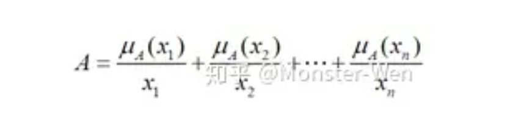

<!--
 * @Author: zhangL2auto
 * @Date: 2024-01-22 13:27:37
 * @LastEditors: 2auto deutschlei47@126.com
 * @LastEditTime: 2024-02-02 10:20:26
-->
## 模糊理论
**模糊**是相对于**确定**来定义的，生活中年龄20岁、误差0.6等这样的量都是**唯一确定**的，可直接计算得出部分结论；但生活中同样还存在年轻、误差小等这样**描述量的词**，我们认为它们是**模糊的**。
简单说：确定的：不是0就是1；模糊的：[0,1]的隶属度
1. 基本定义
   1. **论域**：问题讨论的范围，即是全集，常用U表示
      1. 模糊的量往往是要限定在一定语义环境中的，例如10个老年人讨论谁更年轻，在这堆人里也许50岁就算很年轻了，但按常理来说50岁其实并不算年轻，这就是讨论模糊时范围的重要性。
   2. **因素集**：论域中的元素组成的集合，即模糊集合
      1. 把论域中的因素统一表示出来，记作U={u1,u2,…,un}，ui表示论域内的元素，如讨论年龄大小问题中50岁这个元素。
   3. **模糊集合**和**隶属函数**：因素集A的隶属函数，uA(x)为隶属度，**A -> [0,1]**
      1. 通过隶属函数计算出反映**集合元素**属于该**集合的程度**。
      2. 论域U中有0岁到200岁的人，构成年轻集A和年老集B两个集合，x表50岁，则μA(x)=0.2表50岁是年轻集的程度为0.2，μB(x)=0.7表50岁是年老集的程度为0.7
   4. 
2. 模糊集合的定义
   1. 模糊集合分为离散型和连续型，主要使用离散型
   2. 离散型主要有三种：Zaden表示，序偶表示法，向量表示法
      1. Zaden表示法：最常用
         1. 集合A中的元素x如下表示，这里面使用+不表相加而表连接，分式不表分数表隶属度和元素的对应。
         2. 

3. 隶属函数的定义
   1. **隶属函数**和**隶属度**是我们运算中最重要的东西，因为通过**隶属函数**我们将一些描述性的量转变为了确定的值，即**隶属度**。那我们怎么得到隶属函数呢？常用的有模糊**统计方法**和**指派法**。
      1. 指派法：最常用根据现有问题，套用已有模糊分布，通过拟合数据求分布参数。常用的分布类型有正态型、梯形型、k次抛物线型等，这里给出常用的梯形和三角形
         1. 梯形型
         2. 

## 模糊控制
模糊控制是以**模糊集理论**、**模糊逻辑推理**为基础的一种智能控制方法，它是从行为上模仿人的模糊推理和决策过程的一种智能控制方法。该方法首先将操作人员或专家经验**编成模糊规则**，然后将来自传感器的**实时信号模糊化**，**将模糊化后的信号作为模糊规则的输入**，完成**模糊推理**，然后**解模糊**将推理后得到的输出量加到执行器上。
### 模糊控制系统组成
可以简单理解为：将经典PID控制回路中的PID模块改成了模糊控制模块。其中，模糊控制器的内部结构可以分为3部分：
在系统控制时，输入信号（往往是期望值与返回值的误差e进入模糊控制器，先进行**模糊化**，即将连续的信号转为离散的信号，将原论域转为离散论域；之后根据离散论域中的离散值，在**模糊规则**库中采取相应的模糊控制规则；最后将控制信号再进行一步逆操作**解模糊**，把离散论域转化回原论域进行输出。

1. 模糊规则：
   1. 模糊控制利用的是人们在长期工程实践中总结出来的控制规律或经验，而不是精确的数学计算。例如，对于在限速60km/h路段驾驶的司机来说，当司机通过感官感受到“车速快”这一“感性”结论后，就会采取“松油门并踩刹车”的操作，这一系列动作中并不含有“定量”的数值（如将刹车踏板踩下几厘米），而是依靠司机的经验和直觉。
   2. 为了模拟这一“依靠直觉”的过程，就需要建立这样一套模糊规则，使得程序能够在面临一些情况时，按照人类的经验给出“相对模糊且大概”的调整方式，而不是定量的调整。
        对于上面司机的例子来说，他在限速路段行车过程中所面临的所有情况可能如下：
        若车速过多大于60，则松开油门并踩刹车；
        若车速大于60不多，则松开油门并轻踩刹车；
        若车速略微高于60，则松开油门，不踩刹车；
        若车速等于60，则保持现状，即油门和刹车均不移动；
        若车速略微低于60，则轻踩油门；
        若车速低于60不多，则踩油门；
        若车速过低，则甚至可能考虑切换档位。
   3. 一般地，在控制理论中，通过比较给定值和实际值的误差大小，指定相应的决策策略。对于误差来说，分为正大、正中、正小、零、负小、负中、负大几种情况，用PB、PM、PS、ZE、NS、NM、NB表示。
        对于上述行车的例子，设车速与规定车速60的误差为e ee，则可以表示为：
        if e == PB, then 油门 == NB and 刹车 == NM;
        if e == PM, then 油门 == NB and 刹车 == NS;
        if e == PS, then 油门 == NB and 刹车 == ZE;
        if e == ZE, then 油门 == ZE and 刹车 == ZE;
        if e == NS, then 油门 == PS and 刹车 == ZE;
        if e == NM, then 油门 == PM and 刹车 == ZE;
        if e == NB, then 油门 == PB and 刹车 == ZE；

### 模糊控制流程
1. 选择输入输出模糊集
2. 定义输入输出隶属度函数（不同的隶属度函数，会导致不同的控制特性）
3. 建立模糊控制表
4. 建立模糊控制规则
5. 模糊推理
6. 反模糊化
7. 输出结果
#### 模糊算法的原理
　　模糊算法是一种基于智能推理的算法，虽然称之为模糊算法其实并不模糊，实际上是一种逐步求精的思想。一个模糊控制器主要是由模糊化，模糊推理机和精确化三个功能模块和知识库（包括数据库和规则库）构成的。在此我们近讨论模糊控制的几个主要问题。

1.1、**输入量的量化**
　　输入数据都是精确的，要实现模糊算法需要现对其实现量化。所谓量化就是通过量化函数将输入量投射到一定的数字级别，一般都是相对于0对称的数字区间。具体投射到怎样的区间根据实际情况而定，因为这会直接影响到计算的精度。
1.2、**模糊化**
　　模糊化是模糊算法非常重要的一步，首先确定对应各语言变量的模糊子集，然后根据量化的结果，我们就可以判断该输入所属的集合并计算出对应的隶属度。计算隶属度的方法有很多，最常用的是使用三角形隶属度函数或梯形隶属度函数等来计算获得。
1.3、**规则库**
　　规则库是基于控制量的模糊化而的味道的，是实现模糊推理的基础，很大程度上依赖于经验来完成。规则库的表现形式可以有多种，具体实现的形式根据我们实现的方便。
1.4、**推理机**
　　推理决策才是模糊控制的核心，它利用知识库中的信息和模糊运算方式，模拟人的推理决策的思想方法，在一定的输入条件下激活相应的控制规则给出适当的模糊控制输出。
1.5、**解模糊**
　　我们通过模糊推理，得到一系列的模糊表达，需要进行解模糊操作才能得到紧缺的数据。常用的解模糊方法有：
        1. 最大隶属度法——计算简单，适用于控制要求不高场合。
        2. 重心法——输出更平滑，但计算难度大
        3. 加权平均法——一般在工业上应用最广泛

## 模糊PID
模糊PID即为在PID控制的基础上，与模糊控制进行结合，使得PID的三个系数可以在线改变，可以说，模糊PID控制器是将模糊算法与PID控制参数的**自整定相结合**的一种控制算法。

模糊PID控制是以偏差e及偏差的变化de为输入，利用模糊控制规则在线对PID参数进行调整，以满足不同的偏差e和偏差的增量de对PID参数的不同要求，从而达到PID控制器参数的自适应调节的效果。其结构图如下：

### 模糊PID算法的设计
1. 输入值的模糊化
   1. 输入值的模糊化就是将用于计算的**输入**对应到**标准化的数值区间**，并根据**量化结果**和**模糊化子集**得到该输入对子集的**隶属度**。我们在使用偏差e和偏差增量de作为输入实现控制参数调整则需要对e和de进行模糊化。
   2. 确定**量化函数**，将e和de的具体值和模糊集对应上。要确定量化函数，我们先引入e和de模糊集对应的**论域**，定义为 **{-3，-2，-1，0，1，2，3}**，论域可以说是一个认为定义的范围，由于e, de和kp, ki, kd的范围各不相同，所以把输入映射到论域上，会更好的处理。
   3. 确定e和de的**模糊子集**，对于PID控制我们选则：负大[NB]、负中[NM]、负小[NS]、零[ZO]、正小[PS]、正中[PM]、正大[PB]等7个语言变量就能够有足够精度表达其模糊子集。所以我们定义e和de的模糊子集均为 **{NB，NM，NS，ZO，PS，PM，PB}**，模糊子集分类是对论域进行划分。
   4. 确定**隶属度函数**，隶属度是一个介于0和1之间的值，用以描述对应一个输入属于某一个模糊自己的程度。一般我们描述成隶属度函数，可采用的隶属度函数很多，我们在次采用线性的隶属度函数，或者称为三角隶属度函数，其函数关系如下：

**例子（PID）**：
**a.** 针对上面的描述：对每一个端点进行等级划分，-3—>NB(负大), -2—>NM(负中), -1---->NS(负小), 0—>ZO(零), 1---->PS(正小), 2---->PM(正中), 3---->PB(正大)，假如输入e的范围[-10, 10]，此时e的值为8，通过映射到论域后，值为2.4，2.4在[2, 4]区间；

**b.** 隶属度函数的值域为[0,1],若输入e经过映射后的值为 2.4，那么对应下图红线与绿线的值分别为 0.6，0.4, 这两个就是隶属度，表示该输入属于 PM 的概率为0.6，而属于 PB 的概率为0.4。所以隶属度也为概率。

**c.** 通过上面的论域，总结模糊化的过程：区间映射，模糊对应，隶属度函数计算：

2. 建立模糊规则表
   1. 模糊推理，即通过e, de的隶属度进行查表得到输出的大小程度，即NB, NS等，所以模糊推理的核心就是建立规则表；
   2. 在这里我们要对Kp、Ki和Kd三个参数进行调整，所以要建立这3个变量的模糊规则库。
   3. Kp模糊规则设计
   在PID控制器中，Kp值的选取决定于系统的响应速度。增大Kp能提高响应速度，减小稳态偏差；但是，Kp值过大会产生较大的超调，甚至使系统不稳定减小Kp可以减小超调，提高稳定性，但Kp过小会减慢响应速度，延长调节时间。因此，调节初期应适当取较大的Kp值以提高响应速度，而在调节中期，Kp则取较小值，以使系统具有较小的超调并保证一定的响应速度；而在调节过程后期再将Kp值调到较大值来减小静差，提高控制精度。基于上述描述我们定义Kp的模糊规则如下：
   
   4. Ki模糊规则设计
   在系统控制中，积分控制主要是用来消除系统的稳态偏差。由于某些原因(如饱和非线性等)，积分过程有可能在调节过程的初期产生积分饱和，从而引起调节过程的较大超调。因此，在调节过程的初期，为防止积分饱和，其积分作用应当弱一些，甚至可以取零；而在调节中期，为了避免影响稳定性，其积分作用应该比较适中；最后在过程的后期，则应增强积分作用，以减小调节静差。依据以上分析，我们制定的Ki模糊规则如下：
   
   5. Kd模糊规则设计
   微分环节的调整主要是针对大惯性过程引入的，微分环节系数的作用在于改变系统的动态特性。系统的微分环节系数能反映信号变化的趋势，并能在偏差信号变化太大之前，在系统中引入一个有效的早期修正信号，从而加快响应速度，减少调整时间，消除振荡．最终改变系统的动态性能。因此，Kd值的选取对调节动态特性影响很大。Kd值过大，调节过程制动就会超前，致使调节时间过长；Kd值过小，调节过程制动就会落后，从而导致超调增加。根据实际过程经验，在调节初期，应加大微分作用，这样可得到较小甚至避免超调；而在中期，由于调节特性对Kd值的变化比较敏感，因此，Kd值应适当小一些并应保持固定不变；然后在调节后期，Kd值应减小，以减小被控过程的制动作用，进而补偿在调节过程初期由于Kd值较大所造成的调节过程的时间延长。依据以上分析，我们制定Kd的模糊规则如下：
   
   6. 后处理
  根据偏差E和偏差增量DE模糊化的结果以及规则库推理出∆Kp、∆Ki、∆Kd对应的模糊子集。由于前面我们设计的是采用隶属度函数来定义输入输出量在模糊子集的隶属度，所以推理出来的∆Kp、∆Ki、∆Kd的模糊子集通常是一个由模糊变量组成的矩阵。而输入量e和de则是一个由模糊变量组成的向量
  **例子（PID）:**
  **a.** 假设此刻输入e为8，de为-12，而e的范围为[-1, 10], de的范围为[-20, 20]。通过通过模糊化得到 e 的隶属度为0.6(PM)与0.4(PB)，de/dt 的隶属度为0.8(NM)与0.2(NS)，对 e 与 de/dt 的隶属度进行两两组合，并进行查表，得到下表的关系：
  
  **b.** 继而计算输出Kp，Ki, Kd的隶属度
  
  **c.** 最后进行个输出的隶属度进行整合，例如 Kp, 由上面计算可知，Kp 的隶属度为 0.8(ZO)，0.12(NS)，0.08(NM)。

1. 解模糊处理
    1. 解模糊就是根据模糊推理得到的**各个输出的隶属度**计算出在论域中的**那个值**，然后根据**映射区间**，得到**输出**的Kp，Ki和Kd值。
    2. 我们前面设计了三角隶属度函数，并采用相同的量化目标即论域{-3，3}，所以在某一时刻，输入输出所处的模糊变量的隶属度是相同的，基于这一基础，我们采用重心法计算各输出量的量化值。

**例子（PID）：**
**a.** 以上面的例子进行阐述计算的过程。由上面可知，Kp 的隶属度为0.8(ZO)，0.12(NS)，0.08(NM), 而在论域讲解时，已经将 ZO 的值定为0，NS 的值定为-1，NM 的值定为-2。那么 Kp 的期望为:

**b.** 把期望作为 Kp 在论域的值，在确定 Kp 的范围后，根据区间映射公式，可得出 Kp 的输出值。
**c.** 值得注意的是，输出的 Kp, Ki, Kd 为增量。在初始化时要确定输入与输出的范围（区间），用于进行区间映射。

## 神经网络PID
PID控制要获得较好的控制效果，就必须通过调整好比例、积分和微分三种控制作用，形成控制量中既相互配合又相互制约的关系，这种关系不一定是简单的“线性组合”，从变化无穷的非线性组合中可以找出最佳的。神经网络所具有的任意**非线性表达**的能力，可以通过对系统性能的学习来实现具有最佳组合的PID控制。采用BP神经网络，可以建立参数Kp、Ki、Kd自学习的PID控制器
基于BP神经网络的PID控制系统结构框图如下图所示：设定值r, 误差e, 实际值y是神经网络的三个输入：

该结构采用增量式PID控制算法;
位置式 PID 累加了整个过去状态的偏差值 e(k)，需要处理器具备优秀的存储和计算能力，但若系统出现传感器故障或外界强干扰，会造成整个系统的剧烈变化，误差积累下难以返回当前最佳状态:

BP神经网络PID控制算法可总结为：
    （1）确定BP神经网络结构，即确定输入层和隐含层的节点个数，选取各层加权系数的初值wij(0)、wli(0),选定学习速率和惯性系数，此时k=1;
    （2）采样给定和反馈信号，即r(k)和y(k),计算误差e(k)=r(k)-y(k);
    （3）确定输入量;
    （4）根据上述公式，计算各层神经元的输入、输出，神经网络输出层即为PID控制器的三个可调参数Kp、Ki和Kd;
    （5）由增量式PID控制公式，计算PID控制器的控制输出u(k);
    （6）进行神经网络学习，实时自动调整输出层和隐含层的加权系数wli(k)和wij(k)，实现PID控制参数的自适应调整;
    （7）置k=k+1，返回步骤（2）;

### BP神经网络的结构

    
## 神经网络模糊PID
模糊神经网络，是使用神经网络来实现模糊推理，代替原来使用人类经验或者规则制定的模糊推理。
1. 可以利用神经网络的学习能力来调整模糊控制的控制规则、模糊化和去模糊化的方式，使模糊控制具有了一定的自适应能力；
2. 模糊规则使神经网络的结构和权值，有了明确的意义，有了理论基础
3. 
4. 
5. 
6. 