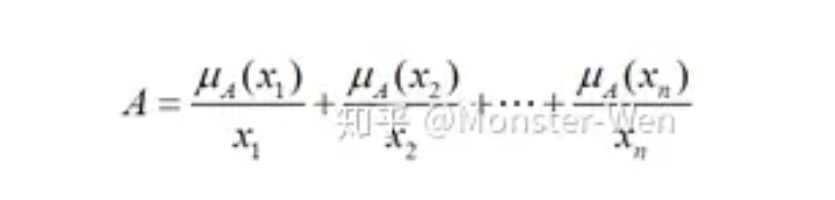
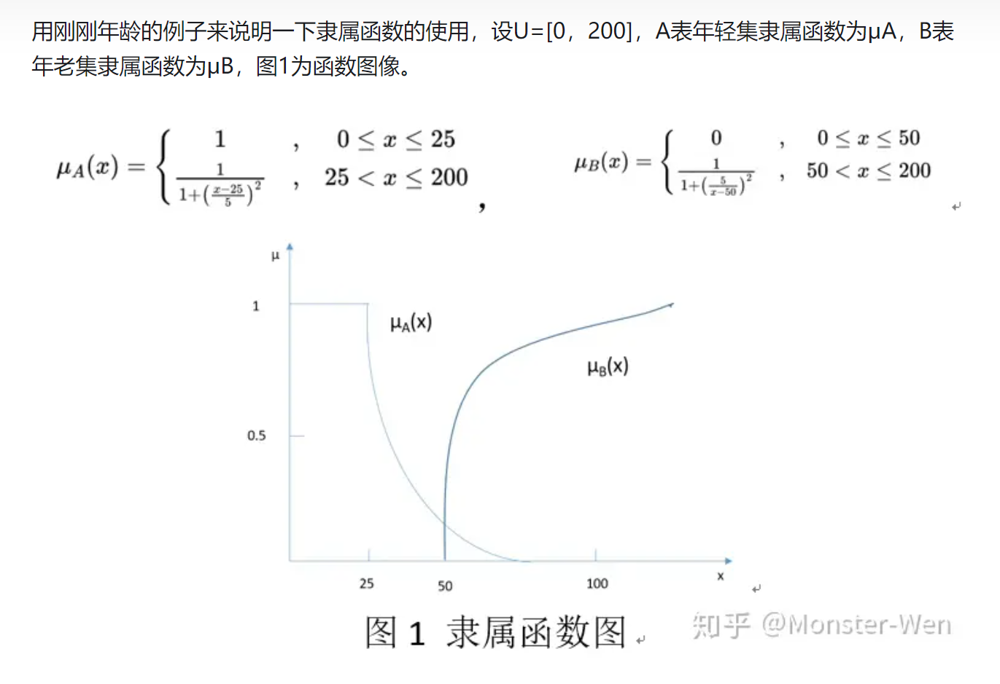

# 温度控制总结

## 温度控制模块
1. 温度控制器是一种用来控制温度而无需操作人员的大量参与的仪器。温度控制系统的控制器从**热电偶或RTD**等温度传感器接收输入信号后， 将实际温度与所需控制温度或设定值进行比较。然后将**输出信号**提供给**控制元件**。
2. 控制器从温度传感器接收输入信号，并将输出信号发送至所连接的**加热器**或**风扇**等控制元件。控制器通常只是整个温度控制系统的一部分，因此在选择适当的控制器时，应对整个系统进行分析和考量。
### 温度控制模块原理
#### 开/关控制
**开关控制器**是最简单的一类温度控制设备。此类设备的输出非开即关，无中间状态。只有温度浮动于设定值时，开关控制器才会切换输出。在加热控制中，当温度低于设定值时，输出接通，并在高于设定值时则输出断开。每当温度跨越设定值时，控制器都会切换输出状态，因此过程温度将不断循环，从低于设定值上升到超过设定值，再降回至设定值以下。为**防止因循环速度过快而损坏接触器和阀门**，应在控制器操作中**增加一个开关差值**，又称“**迟滞**”。采用这种机制时，只有在温度超过设定值一定程度后，输出才会再次关闭或打开。这样，当温度围绕设定值上下循环波动时，开关差值可防止输出“抖动”或快速频繁的切换。开关控制通常用于以下应用场合：无需精确控制的应用、无法处理能源频繁开关的系统、因质量较大而温度变化极为缓慢的系统，以及需要温度报警的场合。限值控制器是用于报警的一种特殊类型开关控制。这种控制器采用必须手动复位的自锁继电器，可在达到特定温度时关闭过程。
#### 比例控制
比例控制设计用于**消除伴随通断控制的循环**.在温度接近设定点的同时，比例控制器降低向加热器供应的平均功率。这会放慢加热器加热的效果，从而使之不会超越设定点，而是会接近设定点并维持一个稳定的温度。此比例控制操作可以通过短时间开启和关闭输出来实现。此"时间比例控制"通过改变"开启"时间与"关闭"时间之比来控制温度。比例控制操作在设定点温度**附近的“比例带”内**才动作。在此比例带之外，控制器作为开关装置工作，无论输出全开（小于比例带）还是全关（大于比例带）。然而，在比例带以内，输出的开启和关闭与测量值和设定点之差成比例。在设定点（比例带的中点），输出开关比例是1:1，即接通时间和断开时间相等。如果温度远离设定点，这表示开启时间和关闭时间的变化与温差成比例。如果温度低于设定点，输出的开启时间更长；如果温度过高，则输出的关闭时间更长。
#### PID控制
第三种控制器类型在比例控制的基础上引入积分和微分控制，即**PID控制**。这种控制器将比例控制与另外两种调整机制相结合，有助于设备对系统中的变化进行自动补偿。积分和微分调整以时间为单位来表示，又分别称为“复位”和“速率”调整。必须针对特定系统通过反复试错来调整或“整定”比例、积分和微分项。在三种控制器类型中，PID控制器的精确性和稳定性最高，最适合用于质量相对较小的系统，以及对过程中能量的变化十分敏感的系统。对于负载变化频繁的系统、以及因设定点、可用能量或被控质量的频繁变化而需要通过控制器进行自动补偿的系统，都建议使用此类控制器。OMEGA提供多款可自动进行自整定的控制器供选择。这些控制器被称为自整定控制器。

## PID恒温控制
PID是闭环控制算法，要实现PID算法，必须在**硬件上具有闭环控制**，这就得有反馈。比如控制一个温度，就得有一个**测量温度的传感器**，并将结果反馈到控制路线上，实现温度的控制。
### PID温度控制实现
1. 离散化PID

## 模糊理论
**模糊**是相对于**确定**来定义的，生活中年龄20岁、误差0.6等这样的量都是**唯一确定**的，可直接计算得出部分结论；但生活中同样还存在年轻、误差小等这样**描述量的词**，我们认为它们是**模糊的**。
简单说：确定的：不是0就是1；模糊的：[0,1]的隶属度
1. 基本定义
   1. **论域**：问题讨论的范围，常用U表示
      1. 模糊的量往往是要限定在一定语义环境中的，例如10个老年人讨论谁更年轻，在这堆人里也许50岁就算很年轻了，但按常理来说50岁其实并不算年轻，这就是讨论模糊时范围的重要性。
   2. **因素集**：论域中的元素组成的集合，即模糊集合
      1. 把论域中的因素统一表示出来，记作U={u1,u2,…,un}，ui表示论域内的元素，如讨论年龄大小问题中50岁这个元素。
   3. **模糊集合**和**隶属函数**：因素集A的隶属函数，uA(x)为隶属度，A -> [0,1]
      1. 通过隶属函数计算出反映**集合元素**属于该**集合的程度**。
      2. 论域U中有0岁到200岁的人，构成年轻集A和年老集B两个集合，x表50岁，则μA(x)=0.2表50岁是年轻集的程度为0.2，μB(x)=0.7表50岁是年老集的程度为0.7
   4. 
2. 模糊集合的定义
   1. 模糊集合分为离散型和连续型，主要使用离散型
   2. 离散型主要有三种：Zaden表示，序偶表示法，向量表示法
      1. Zaden表示法：最常用
         1. 集合A中的元素x如下表示，这里面使用+不表相加而表连接，分式不表分数表隶属度和元素的对应。
         2. 

3. 隶属函数的定义
   1. **隶属函数**和**隶属度**是我们运算中最重要的东西，因为通过**隶属函数**我们将一些描述性的量转变为了确定的值，即**隶属度**。那我们怎么得到隶属函数呢？常用的有模糊**统计方法**和**指派法**。
      1. 指派法：最常用根据现有问题，套用已有模糊分布，通过拟合数据求分布参数。常用的分布类型有正态型、梯形型、k次抛物线型等，这里给出常用的梯型
         1. 梯形型
         2. 

## 模糊控制
模糊控制是以**模糊集理论**、**模糊逻辑推理**为基础的一种智能控制方法，它是从行为上模仿人的模糊推理和决策过程的一种智能控制方法。该方法首先将操作人员或专家经验**编成模糊规则**，然后将来自传感器的**实时信号模糊化**，**将模糊化后的信号作为模糊规则的输入**，完成**模糊推理**，将推理后得到的输出量加到执行器上。

### 模糊规则
模糊控制只是模糊理论应用之一，在进行模糊控制之前，需要对模糊理论熟悉理解；
#### 模糊理论基本概念
1. 论域

### 模糊控制规则
**模糊控制**是以**模糊集理论、模糊语言变量和模糊逻辑推理**为基础的一种智能控制方法，它是从行为上模仿人的模糊推理和决策过程的一种智能控制算法。模糊控制**首先将操作人员或专家经验编成模糊规则**，然后将来自传感器的**实时信号模糊化**，将**模糊化后的信号作为模糊规则的输入**，完成**模糊推理**，将推理后得到的输出量加到执行器上。

## 神经网络模糊PID